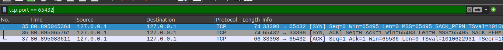
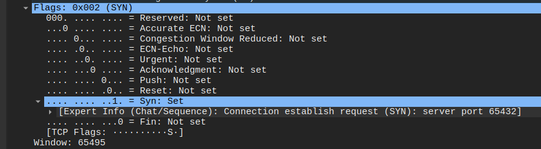
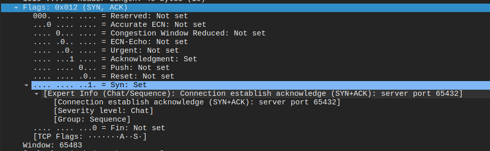
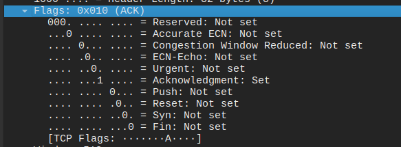
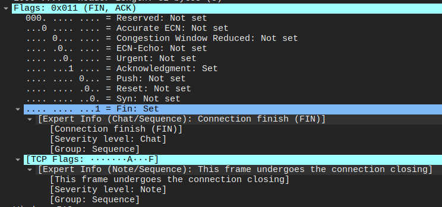

### Descrição da captura do Wireshark

O Wireshark foi iniciado capturando pacotes na interface de loopback.
Aplicando o filtro tcp.port == 65432:

Identificando o Three-way handshake (SYN, SYN-ACK, ACK)

**SYN**:

**SYN-ACK**:

**ACK**:

**Fechamento de conexão (FIN, ACK)**:

---

### Problemas identificados no código original e soluções implementadas

| Problema | Solução |
| -------- | ------- |
| Servidor indisponível no início da conexão | Uso de `try`/`except` para capturar ConnectionRefusedError e socket  | Solução |
| Servidor que cai durante a comnunicação |  Detecção da perda de conexão com `if not data` e encerramento automático do cliente com aviso ao usuário  |
|Timeout de resposta do servidor | Adicionado s.settimeout(10), se o servidor não responder, o cliente é encerrado com aviso |
| Falta de validação de comandos do usuário | função `validar_comando()` para validar comandos /nick e /whisper antes de enviar evitando uso incorreto e mensagens quebradas |
| Encerramento | Tratamento de KeyboardInterrupt e exceções genéricas para enviar /quit ao servidor antes de fechar o socket e sair de forma limpa |
| Mensagens vazias sendo enviadas |	Ignoradas com `if not message.strip(): continue`, evitando flood desnecessário no chat |
---
 **(soluções imlementadas no código "cliente_chat_melhorado.py")**

###  Resultados dos testes de resiliência
